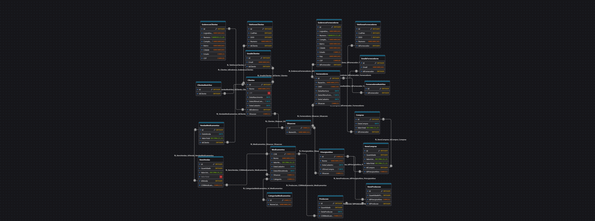

# SneezePharma_SQL

Anteriormente os registros do projeto SneezePharma eram persistidos em arquivos .TXT. 
Agora a demanda foi criar um Banco de Dados para armazenar esses registros.

# Ordem de Execução dos Scripts
1 - CREATE_SCHEMA.sql 
2 - TRIGGERS_SNEEZEPHARMA.sql 
3 - PROCEDURES.sql 
4 - POPULATION_SCHEMA.sql 
5 - QUERY_SQL.sql 

# Diagrama Conceitual (ME-R)

# Diagrama E-R (Lógico/Físico)
A resolução do PNG está um pouco ruim, mas com o zoom melhora. 

Caso ache melhor acessar o link do diagrama: [DrawDB](https://www.drawdb.app/editor?shareId=342920469cb2b7f214e765b83ccb0368)